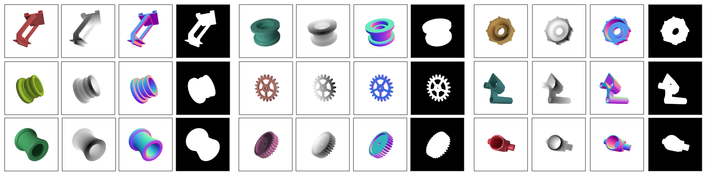

# Rendering ABC Objects

## Editing `data_generation_parameters.json`

Once the ABC `.obj` files are downloaded, the first step is to make the appropriate edits to `data_generation_paramters.json` which is the rendering config file.

- `light_parameters`, `render_parameters`, and `material parameters` have reasonable default values that result in images as featured above. Editing them and doing small test renders is the best way to see the effect they have on the output. `render_parameters` are set up to ensure fast GPU rendering.
- The values under `camera` are `focal_length`, `sensor_size` and `distance_units` which is camera distance. All values are in Blender units.
- `paths`
    - `blender_path`- path to the Blender executable that's been downloaded based on the directions above
    - `ABC_path` - path to the downloaded ABC dataset. This directory (e.g. `ABC_dir`) should contain one directory for each object
        ```
        ...
        ../ABC_dir/00125680_57064f77e4b07e8c7faab10b_trimesh_003.obj
        ../ABC_dir/00126070_20ff81f8de5ec0b4ac39a019_trimesh_003.obj
        ../ABC_dir/00127026_5cac9be66a5f1e609c987f7a_trimesh_005.obj
        ...
        ```
    - `output_path` - path where the renders will be saved. 
- `gen_params`
    - `elev_range` - elevation range for sampling object views; default is `[-50, 50]`
    - `azim_range` - azimuth range for sampling object views; default is `[0, 360]`
    - `n_points`- number of images generated in object poses sampled from the range defined by the previous two values
    - `debug` - in this mode the object is rendered at a fixed elevation with uniform azimuth increments
    - `jitter_lights` - whether to vary the lights or not within the defined parameters in `light_parameters`
    - `lambertian` - an option to render all objects with a white lambertian shader. Default is shown in the image samples above.
    - `3DOF_vc` - randomly rotate the object once before sampling in `azim_range` and `elev_range`. This allows for greater variability in object poses accross the dataset. 
    - `outputs` - list of `["image", "albedo", "normal", "depth_absolute", "depth_01", "segmentation"]` which defines the types of outputs that should be generated. `depth_absolute` indicates absolute depth images and `depth_01` indicates relative depth images where `min=0` and `max=1`.
