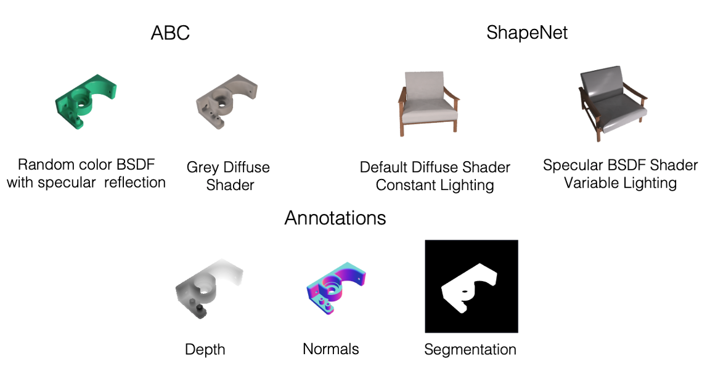

This repository contains code to render the [ShapeNet](https://shapenet.org/) and [ABC](https://deep-geometry.github.io/abc-dataset/) datasets from various poses, lighting and material properties.

# Rendering ShapeNet and ABC using Blender 2.79b

Note: there is overlap in the code for ShapeNet and ABC but there are subtle differences that would make a unified codebase more complex without significant gain.

## Step 1. Blender Installation for MacOS and Ubuntu Linux (Windows instructions pending)
Download Blender 2.79b for your operating system from the official [Blender release](https://download.blender.org/release/Blender2.79/).

For MacOS the default installation path is
 `/Applications/Blender/blender.app/Contents/MacOS/blender`,
 and for Linux it involves extracting a `blender-2.79b-linux-glibc219-x86_64.tar`  which makes the path
 `<path to extracted tarball>/blender-2.79b-linux-glibc219-x86_64/blender`.

Depending on your OS, add the appropriate path in the `data_generation_parameters.json` file under the key `"blender_path"`.
The file `data_generation_paramters.json` is used for both ABC and ShapeNet.

## Step 2

1. Download the datasets from their respective locations
2. Further instructions are included in each dataset directory
     - [ABC](./ABC/readme.md)
     - [ShapeNet](./ShapeNet/readme.md)
